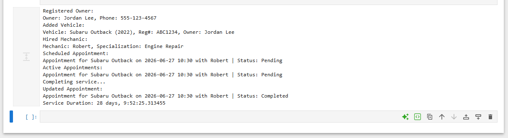

# Vehicle Service Management System

A Python application developed for **CS 2250: Programming and Data Structures in Python** at the **University of Missouri–St. Louis (UMSL)**.

## Overview

This project models the operation of an automotive service center using object-oriented programming principles. The application allows users to register vehicle owners, manage vehicles, hire mechanics, schedule service appointments, and track service completion.

## Program Output

## Features

- Register vehicle owners
- Add and manage vehicles
- Hire mechanics with specializations
- Schedule vehicle service appointments
- Track appointment status
- Mark services as completed
- Calculate service duration using Python's `datetime` module

## Skills Demonstrated

- Python
- Object-Oriented Programming (OOP)
- Classes and Objects
- Encapsulation
- Object Composition
- Lists
- Date and Time Handling (`datetime`)

## Concepts Learned

- Designing object-oriented programs
- Creating and using custom classes
- Modeling real-world relationships through object composition
- Working with Python's `datetime` module
- Organizing related data using lists
- Building a multi-class application

## Files

| File | Description |
|------|-------------|
| `Vehicle_Service_Management_System.ipynb` | Source code |
| `Vehicle_Service_Management_System.html` | Notebook with program output |

## Course

**CS 2250 – Programming and Data Structures in Python**

University of Missouri–St. Louis
